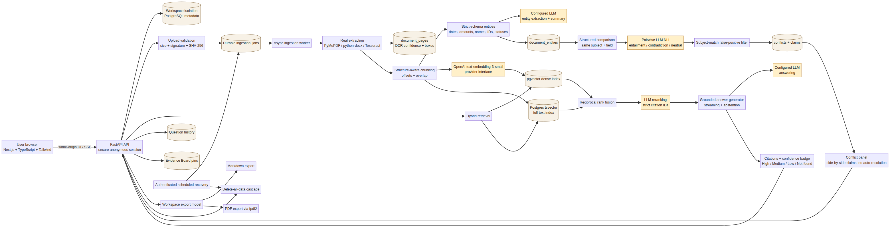

# ALGOTHON'26 Submission — DocuSleuth

## One-line description

DocuSleuth is an evidence-only document investigator: it answers questions from uploaded files, maps claims to stored passages, exposes conflicts instead of choosing a winner, and explains evidence strength without pretending certainty.

## Architecture

Source diagram: [`architecture.mmd`](architecture.mmd). The system is a Next.js/TypeScript/Tailwind investigator UI in front of a FastAPI container. PostgreSQL with `pgvector` is the durable source of truth for workspaces, documents, pages, chunks, entities, jobs, messages, conflicts, claims, trust decisions, summaries, and Evidence Board pins. The worker performs real extraction and indexing; the browser polls durable job status.

## Key technical decisions

### Hybrid retrieval

Each chunk has a real embedding and a generated PostgreSQL `tsvector`. Dense retrieval uses cosine distance in `pgvector`; keyword retrieval uses PostgreSQL full-text ranking. Their ranked lists are merged with reciprocal rank fusion before the top candidates are sent to reranking. This is deliberately described as PostgreSQL full-text ranking, **not exact BM25**. The choice keeps dense semantic matches and exact identifiers/names available together without pretending that the database implements a different ranking algorithm.

### Reranking

The top fused candidates are sent to the configured LLM through a strict JSON schema containing only supplied citation IDs and relevance scores. The model cannot rewrite evidence or invent citation IDs. If reranking is unavailable, the system keeps the real database ranking and reports provider failures rather than substituting fake relevance scores.

### Conflict detection

Ingestion extracts structured entities with document/chunk/page linkage. The conflict pipeline first compares normalized fields for the same subject across different documents, then calls pairwise NLI through the configured LLM with `entailment`, `contradiction`, or `neutral` plus a subject-match boolean. A false-positive filter rejects claims that are not about the same subject. Conflicts remain side by side with file, page-or-section, quote, date/version hints, and severity. Trust decisions are user choices; the system never auto-resolves a conflict.

### Confidence scoring

Every answer carries `High`, `Medium`, `Low`, or `Not found` with a one-line reason. The score considers retrieval strength, independent source count, OCR confidence, and detected conflicts. `Not found` is reserved for the exact abstention response. The badge describes evidence strength, not truth, and cannot override a conflict.

## Known limitations and future improvements

1. **External prerequisites are not currently live in this workspace.** The configured PostgreSQL DSN is not connected and the embeddings key returns HTTP 401. Real upload-to-answer, conflict, and end-to-end metrics are therefore blocked; no mock service is used as a replacement.
2. **Fixture evaluation is pending.** The requested `docusleuth_test_fixtures.zip` and `README_TEST_KEY.md` are not attached. Retrieval recall@k, groundedness, conflict precision/recall, and abstention accuracy are intentionally reported as not measured.
3. **DOCX citations are section-based.** Reliable page-accurate DOCX rendering is not guaranteed in the container, so the app does not fabricate page numbers. A future version can add a LibreOffice/PDF conversion worker with deterministic page mapping.
4. **Tesseract language coverage is configurable but image-dependent.** Scanned mixed-language files require the corresponding Tesseract language data in the image; text PDFs and TXT preserve Unicode without OCR.
5. **The current evaluation runner expects a supported JSON gold-label manifest.** A fixture adapter can be added once the actual package format and key are available, rather than guessing its schema.
6. **The public deployment is not claimed.** The verified URL is a Preview, not a production publication. Deployment remains gated on valid database, embeddings, and LLM credentials plus real-service acceptance tests.
7. **Provider cost and latency remain external variables.** Limits exist for files, questions, candidate pairs, tokens, and response characters, but production observability and queue autoscaling are future work.

## External API, model, dataset, and AI-assisted disclosure

| Component | What DocuSleuth uses | Data sent / purpose | Status |
|---|---|---|---|
| OpenAI Embeddings API | `text-embedding-3-small` by default | Extracted chunks and question text for dense vectors | Configured through `OPENAI_EMBEDDINGS_API_KEY`; current smoke test returned HTTP 401 |
| OpenAI-compatible Chat Completions API | Default model `gpt-4o-mini`, configurable via `LLM_BASE_URL`, `LLM_MODEL`, and `LLM_API_KEY` | Entity extraction, summaries, reranking, NLI, and grounded answer generation | Real provider interface; end-to-end use blocked by unavailable valid service configuration |
| PostgreSQL + pgvector | External database, such as Supabase or Neon | Workspace metadata, document bytes, pages, chunks, vectors, full-text indexes, jobs, histories, conflicts, pins | Required production dependency; not connected in the current run |
| Tesseract | Local OCR runtime in the custom container | Uploaded scanned images/PDF pages | AI-assisted local component; no hosted OCR API and no simulated OCR |
| PyMuPDF | Local PDF parser/rendering | Uploaded PDF bytes | Deterministic extraction/rendering library |
| python-docx | Local DOCX parser | Uploaded DOCX bytes | Deterministic extraction library; citations fall back to sections |
| pdf.js | Browser source-page rendering | Stored PDF content served from the workspace API | Deterministic client viewer, not a model |
| Manus Webdev managed runtime | Project preview, container/static serving, protected secrets, scheduled callback integration | Application traffic and configuration; no document content is sent to Manus as an AI model by this app | Hosting/runtime component |
| fpdf2 | Server-side PDF export | Workspace export model | Deterministic renderer |
| User-uploaded documents | Intended evaluation/investigation data | Only the user's current workspace; no seed data | No fixture archive is currently present |
| User-provided evaluation fixture package | `docusleuth_test_fixtures.zip` and `README_TEST_KEY.md` were requested | Gold labels for 12 planted conflicts, controls, seven unanswerable questions, table/OCR cases | Not attached; no substitute dataset was generated |

No other external dataset, fine-tuned model, hosted OCR service, local embedding model, simulated AI, or seeded document corpus is used.

## Two-minute demo script using documents the user uploads

**0:00–0:15 — Start empty.** Open the Preview and show the empty case-file panel. Read the privacy notice: uploaded documents and selected evidence are sent to the configured AI provider for processing.

**0:15–0:35 — Upload real files.** Drag in two or more documents you choose—for example, two versions of a contract or a report plus an invoice. Point out signature validation, duplicate detection, and the visible `queued → extracting/OCR → indexing → ready` states. Do not use seeded files.

**0:35–0:55 — Inspect document intelligence.** Open a ready document's provider-generated summary and key entities. Use the workspace search box for an exact name, amount, date, or identifier and open the stored result.

**0:55–1:20 — Ask a grounded question.** Ask a question answerable from the uploaded files, such as “What payment date is stated in the documents?” Show the streamed answer, numbered citations, confidence badge, and the source viewer with the exact quote. Click a citation to show its page or section context.

**1:20–1:40 — Demonstrate abstention and conflict handling.** Ask a question not supported by the files. The app should return exactly “I could not find this in the uploaded documents.” If the files contain two claims about the same subject that disagree, run “Scan workspace for conflicts” and show the side-by-side `Conflict detected` panel. Do not mark either claim correct; optionally save a user trust decision.

**1:40–1:55 — Evidence Board and history.** Pin a citation with a note, open Question History, and show that both retain the real quote and source reference for this anonymous workspace.

**1:55–2:00 — Export and close.** Export Markdown or PDF, then point to the `Delete all my data` control. Explain that the export includes answers, citations, confidence, conflicts, trust decisions, and pins, while deletion removes the workspace data.

## Acceptance status

See [`acceptance-checklist.md`](acceptance-checklist.md) for the full item-by-item report. The current result is honest: local unit/edge tests, frontend build, security headers, CORS, static serving, and route-manifest checks pass; real database/provider integration and fixture-backed metrics are blocked by the unavailable prerequisites above.
